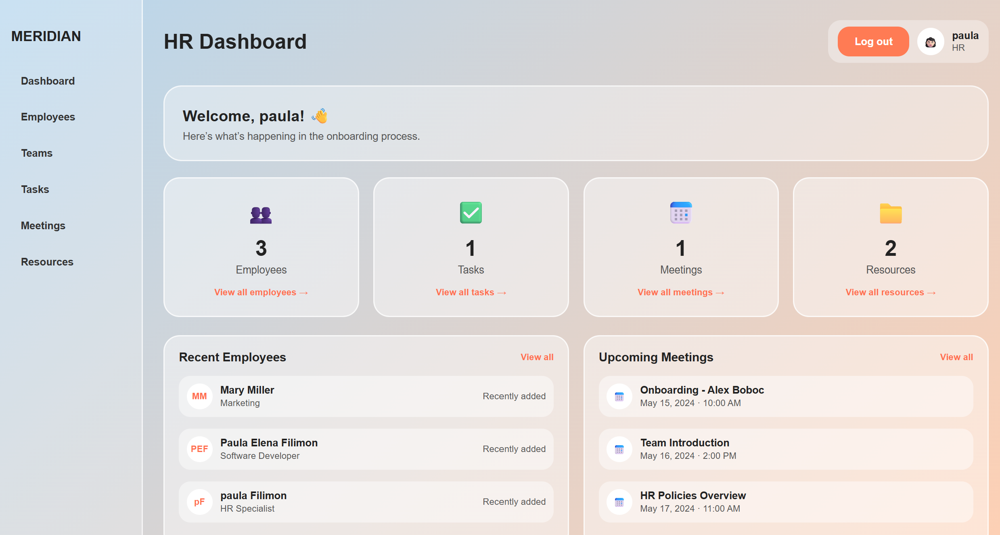
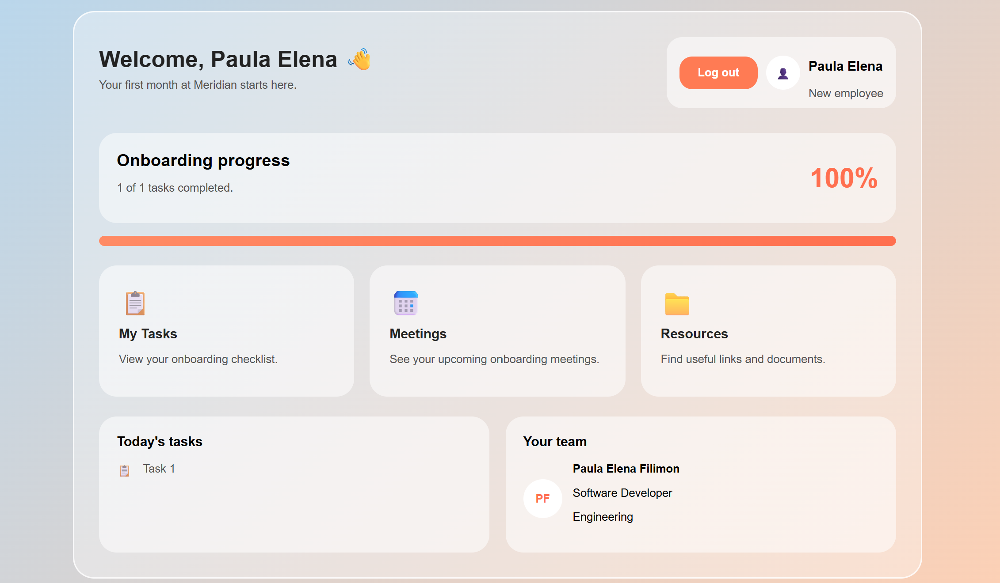

# Meridian Onboarding System

A full-stack onboarding management application built with **ASP.NET Core Web API** and **React**.

The application allows HR to manage the onboarding process for new employees while providing employees with a personalized onboarding dashboard where they can complete assigned tasks, view meetings, and access company resources.

---

# Features

### HR

- Secure login using JWT authentication
- Dashboard with onboarding statistics
- Manage employees (Create, Read, Update, Delete)
- Manage teams (Create, Read, Update, Delete)
- Manage onboarding tasks (Create, Read, Update, Delete)
- Manage meetings (Create, Read, Update, Delete)
- Manage resources (Create, Read, Update, Delete)
- View onboarding progress
- Logout

### Employee

- Secure login
- Personalized dashboard
- View onboarding tasks
- Mark tasks as completed
- View onboarding meetings
- Access onboarding resources
- Track onboarding progress
- Logout

<h3>Application Screenshots</h3>

<p align="center">
  
  
</p>

---

# Technologies

### Frontend

- React
- React Router
- Vite
- Fetch API
- CSS

### Backend

- ASP.NET Core Web API
- Entity Framework Core
- SQL Server LocalDB
- JWT Authentication
- Swagger

---

# Requirements

Before running the project, make sure you have the following installed:

- .NET 8 SDK
- Node.js 18 or later
- SQL Server LocalDB
- Visual Studio 2022 or Visual Studio Code (optional)

---

# Project Structure

The application is divided into two separate projects.

```
MeridianOnboarding
│
├── backend
│   ├── Controllers
│   ├── Data
│   ├── DTOs
│   ├── Migrations
│   ├── Models
│   ├── Services
│   ├── Program.cs
│   └── appsettings.json
│
└── frontend
    ├── src
    │   ├── assets
    │   ├── pages
    │   ├── services
    │   ├── styles
    │   ├── App.jsx
    │   └── main.jsx
    ├── package.json
    └── vite.config.js
```

---

# Architecture Overview

The application follows a classic client-server architecture.

```
React Frontend
        │
   Fetch API (HTTP)
        │
ASP.NET Core Web API
        │
Entity Framework Core
        │
SQL Server LocalDB
```

- React is responsible for the user interface.
- ASP.NET Core Web API exposes REST endpoints.
- JWT is used for authentication and authorization.
- Entity Framework Core handles database access.
- SQL Server LocalDB stores the application data.

---

# Authentication & Security

Authentication is implemented using JSON Web Tokens (JWT).

The application supports two roles:

- HR
- Employee

Role-based authorization restricts access to HR-only functionality, ensuring that management operations can only be performed by HR users, while employees have access only to their own onboarding features.

For simplicity, the JWT signing key is stored in `appsettings.json`. In a production environment, sensitive configuration such as JWT keys and connection strings should be stored using environment variables or User Secrets.

---

# Database

The project uses Microsoft SQL Server LocalDB as the local development database.

Entity Framework Core is used for:

- Database access
- CRUD operations
- Database migrations

The database schema is managed using Entity Framework Core migrations.

---

# API Overview

### Authentication

| Method | Endpoint        |
| ------ | --------------- |
| POST   | /api/Auth/login |

---

### Users

| Method | Endpoint        |
| ------ | --------------- |
| GET    | /api/Users      |
| GET    | /api/Users/{id} |
| POST   | /api/Users      |
| PUT    | /api/Users/{id} |
| DELETE | /api/Users/{id} |

---

## Teams

| Method | Endpoint        |
| ------ | --------------- |
| GET    | /api/Teams      |
| GET    | /api/Teams/{id} |
| POST   | /api/Teams      |
| PUT    | /api/Teams/{id} |
| DELETE | /api/Teams/{id} |

---

## Onboarding Tasks

| Method | Endpoint                             |
| ------ | ------------------------------------ |
| GET    | /api/OnboardingTasks                 |
| GET    | /api/OnboardingTasks/{id}            |
| POST   | /api/OnboardingTasks                 |
| PUT    | /api/OnboardingTasks/{id}            |
| DELETE | /api/OnboardingTasks/{id}            |
| PUT    | /api/OnboardingTasks/{id}/completion |

---

## Meetings

| Method | Endpoint           |
| ------ | ------------------ |
| GET    | /api/Meetings      |
| GET    | /api/Meetings/{id} |
| POST   | /api/Meetings      |
| PUT    | /api/Meetings/{id} |
| DELETE | /api/Meetings/{id} |

---

## Resources

| Method | Endpoint            |
| ------ | ------------------- |
| GET    | /api/Resources      |
| GET    | /api/Resources/{id} |
| POST   | /api/Resources      |
| PUT    | /api/Resources/{id} |
| DELETE | /api/Resources/{id} |

---

## Employee Tasks

| Method | Endpoint                         |
| ------ | -------------------------------- |
| POST   | /api/EmployeeTasks/assign        |
| GET    | /api/EmployeeTasks/user/{userId} |
| PUT    | /api/EmployeeTasks/complete      |

---

# Running the Project

Clone the repository

```bash
git clone https://github.com/FilimonPaula/MeridianOnboarding.git
cd MeridianOnboarding
```

### Backend

Navigate to the backend folder:

```bash
cd backend
```

Restore packages:

```bash
dotnet restore
```

Apply migrations:

```bash
dotnet ef database update
```

Make sure SQL Server LocalDB is installed before running the backend.

Run the application:

```bash
dotnet run
```

Swagger will be available after starting the backend.

---

### Frontend

Navigate to the frontend folder:

```bash
cd frontend
```

Install dependencies:

```bash
npm install
```

Run the development server:

```bash
npm run dev
```

---

# Future Work

For a detailed list of planned improvements and possible future features, see `WHAT_I_WOULD_DO_NEXT.md`.
